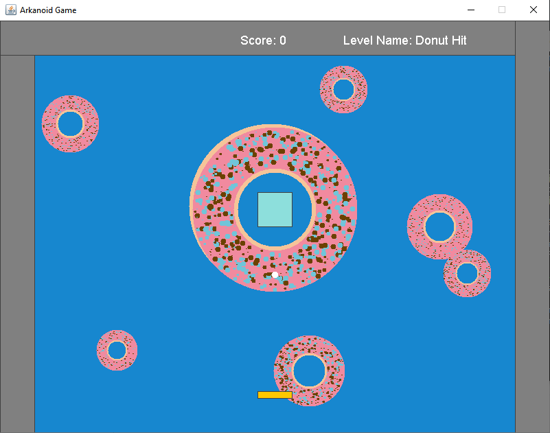
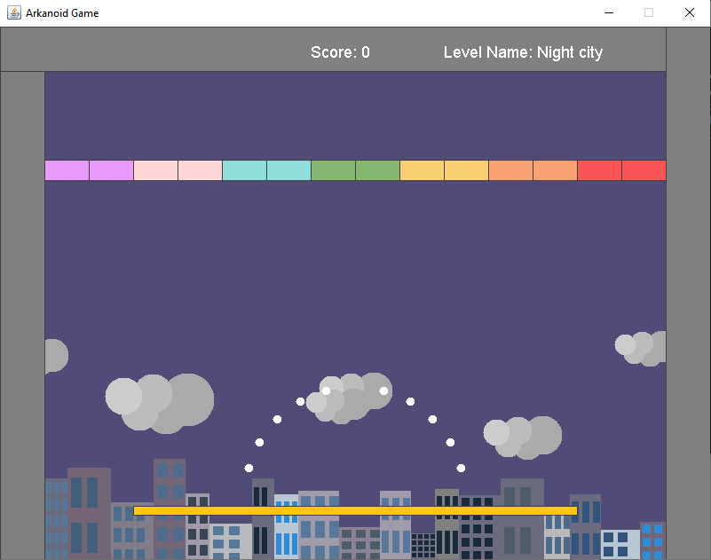
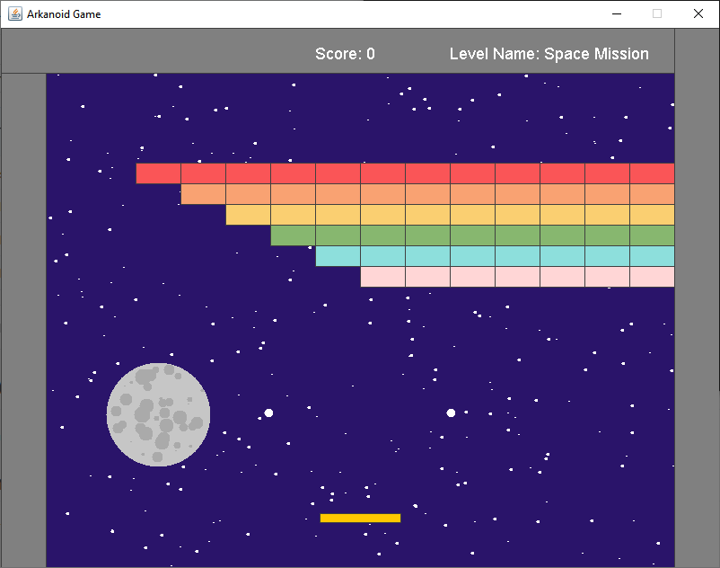
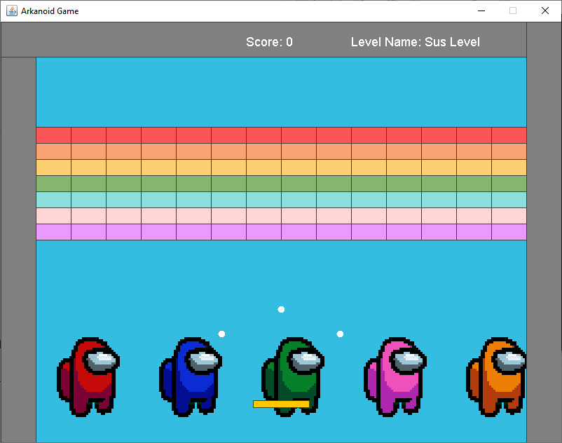

# Arkanoid
The classic Arcade game, written in Java.
Gameplay can be found [here](https://www.youtube.com/watch?v=8FuUTDgTrU8).


## Installation
1. Clone the repo:\
   `git clone https://github.com/Tom-stack3/Arkanoid.git`
2. Compile with ant:\
   `ant compile`

## Running the game
To run with ant (Apache Ant):
```shell
ant run
```

## Screenshots




